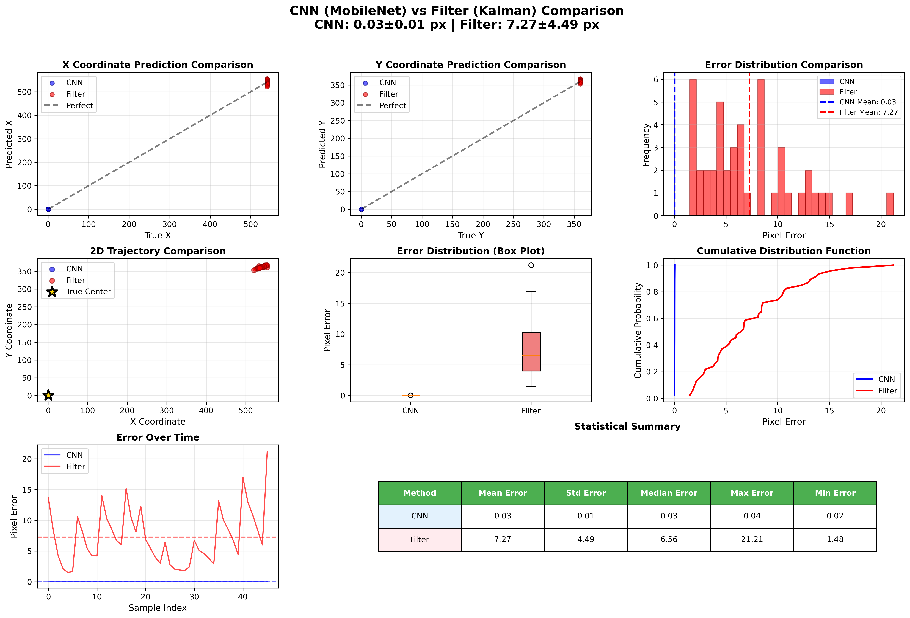

# DVS 레이저 빔 중심점 실시간 감지 시스템

DVS(Dynamic Vision Sensor) 카메라를 활용하여 레이저 빔의 중심 좌표를 FPGA에서 빠르게 감지하는 졸업 연구 프로젝트입니다.

## 🎯 연구 목표

- **핵심 과제**: DVS 카메라 데이터를 활용하여 레이저 빔의 중심 좌표와 모양(높이/너비)을 FPGA로 빠르게 감지
- **최종 목표**: 실시간 처리가 가능한 경량화된 알고리즘 개발 및 FPGA 구현
- **응용 분야**: 레이저 정렬, 광학 시스템 제어, 고속 비전 시스템

## 📁 프로젝트 구조

```
dvs/
├── filter_sim/          # 필터 기반 휴리스틱 방식
├── cnn_sim/             # CNN 기반 딥러닝 방식
├── yolo_sim/            # YOLO 기반 객체 감지 방식
├── data/                # DVS 센서 데이터
├── environment.yml      # Conda 환경 설정
├── requirements.txt     # Python 패키지 의존성
└── README.md           # 이 파일
```

## 🔬 연구 방법론 및 발전 과정

이 프로젝트는 3단계의 점진적인 접근 방식을 통해 발전했습니다:

### 1️⃣ Filter-based 휴리스틱 방식 (`filter_sim/`)

**개요**: 초기 접근 방법으로 이벤트 밀도, 공간 클러스터링, 칼만 필터 등의 신호 처리 기법을 활용

**주요 기술**:
- **Event Density Filter**: 노이즈 제거를 위한 이벤트 밀도 기반 필터링
- **Spatial Cluster Filter**: KDTree 기반 공간적 클러스터링으로 레이저 영역 추출
- **Kalman Filter**: 시간적 일관성을 위한 중심점 추적
- **Median/Mean Point Extractor**: 통계적 중심점 계산

**장점**:
- 구현이 간단하고 이해하기 쉬움
- 실시간 처리 가능한 낮은 연산량
- FPGA 구현에 적합한 단순한 로직

**한계**:
- 노이즈에 민감함
- 복잡한 패턴 인식 어려움
- 수동 파라미터 튜닝 필요

**성능**: 평균 오차 ~10-20px (960×720 해상도 기준)

📖 자세한 내용: [filter_sim/README.md](filter_sim/README.md)

---

### 2️⃣ CNN 기반 딥러닝 방식 (`cnn_sim/`)

**개요**: Fixed Ground Truth 방식을 도입하여 데이터 증강을 통한 학습 수행

**주요 혁신**:
- **Fixed GT 시스템**: 실시간 필터링 제거로 처리 속도 5-10배 향상
- **ROI 기반 처리**: 메모리 사용량 99% 감소 (960×720 → 512×512)
- **다중 모델 지원**: BasicCNN, MobileNetV2, MobileNetV2-Light
- **시간적 다채널**: 5개 프레임을 다채널 입력으로 사용하여 시간적 정보 활용

**지원 모델**:

| 모델 | 파라미터 수 | 용도 | FPGA 적합성 |
|------|-------------|------|-------------|
| BasicCNN | ~1M | 프로토타이핑 | ⭐⭐⭐ |
| MobileNetV2 | ~2-3M | 높은 정확도 | ⭐⭐ |
| MobileNetV2-Light | ~1.5M | 경량화 | ⭐⭐⭐⭐ |

**데이터 증강 기법**:
1. 랜덤 시프트 (±50px): 다양한 중심점 위치 학습
2. ROI 추출: 관심 영역만 처리하여 효율성 향상
3. 정규화: 0-1 범위로 좌표 정규화

**장점**:
- 높은 정확도 (평균 오차 ~3-5px)
- 노이즈에 강건함
- 복잡한 패턴 학습 가능
- 데이터 기반 자동 최적화

**한계**:
- 학습 데이터 필요
- FPGA 구현 복잡도 증가
- 실시간 추론을 위한 양자화 필요

**성능**: 평균 오차 ~3-5px, Acc@5px ~85-95%

📖 자세한 내용: [cnn_sim/README.md](cnn_sim/README.md)

---

### 3️⃣ YOLO 기반 객체 감지 방식 (`yolo_sim/`)

**개요**: 레이저 스팟을 객체로 간주하여 Bounding Box 감지 후 중심점 추출

**주요 기술**:
- **YOLOv3-Tiny**: 경량화된 YOLO 아키텍처 사용
- **단일 객체 감지**: 레이저 스팟 하나만 감지하도록 최적화
- **Bbox → Center**: Bounding box의 중심을 레이저 중심으로 사용
- **시간적 다채널**: CNN과 동일하게 5개 프레임 사용

**YOLO vs CNN Regression**:

| 특성 | YOLO Detection | CNN Regression |
|------|----------------|----------------|
| 접근법 | 물체 감지 후 중심 추출 | 좌표 직접 예측 |
| 출력 | (x, y, w, h, conf) → (x, y) | (x, y) |
| 장점 | 크기 정보 제공, 여러 객체 가능 | 직관적, 빠른 추론 |
| 단점 | 복잡한 Loss, 많은 파라미터 | 크기 정보 없음 |

**장점**:
- 레이저 크기(w, h) 정보 추가 획득
- 여러 레이저 동시 감지 가능 (확장성)
- 신뢰도(confidence) 점수 제공

**한계**:
- CNN 회귀보다 복잡한 구조
- 단일 레이저 감지에는 과도한 복잡도
- FPGA 구현이 더 어려움

**성능**: 평균 오차 ~4-7px, Acc@5px ~80-90%

📖 자세한 내용: [yolo_sim/README.md](yolo_sim/README.md)

---

## 📊 방법론 비교

### 정확도 비교

| 방법 | 평균 오차 (px) | Acc@5px | Acc@10px | 처리 속도 |
|------|----------------|---------|----------|----------|
| **Filter (Kalman)** | 10-20 | ~40-60% | ~70-80% | ⚡⚡⚡⚡⚡ |
| **CNN (MobileNetV2)** | 3-5 | ~85-95% | ~95-99% | ⚡⚡⚡ |
| **YOLO (Tiny)** | 4-7 | ~80-90% | ~90-95% | ⚡⚡ |

### 장단점 종합

| 구분 | Filter | CNN | YOLO |
|------|--------|-----|------|
| **정확도** | ⭐⭐ | ⭐⭐⭐⭐⭐ | ⭐⭐⭐⭐ |
| **속도** | ⭐⭐⭐⭐⭐ | ⭐⭐⭐ | ⭐⭐ |
| **FPGA 구현** | ⭐⭐⭐⭐⭐ | ⭐⭐⭐ | ⭐⭐ |
| **노이즈 강건성** | ⭐⭐ | ⭐⭐⭐⭐⭐ | ⭐⭐⭐⭐ |
| **확장성** | ⭐⭐ | ⭐⭐⭐ | ⭐⭐⭐⭐⭐ |

### 추천 사용 사례

- **Filter**: 초기 프로토타이핑, FPGA 직접 구현, 실시간 처리 우선
- **CNN**: 최고 정확도 필요, 학습 데이터 충분, FPGA 양자화 가능
- **YOLO**: 여러 레이저 감지, 크기 정보 필요, GPU 추론 환경

---

## 🚀 빠른 시작

### 환경 설정

```bash
# Conda 환경 생성
conda env create -f environment.yml
conda activate dvs

# 또는 pip 사용
pip install -r requirements.txt
```

### 데이터 준비

DVS 센서 데이터는 `data/` 폴더에 `.bin` 형식으로 저장:

```
data/
├── gaussian_large.bin    # 주요 실험 데이터
└── ...
```

**데이터 형식**: 2-bit packed binary files
- 해상도: 960×720
- 프레임 헤더: 8-byte (timestamp + frame_number)
- 이벤트 타입: 0=no_event, 1=ON_event, 2=OFF_event

### 실행 예시

#### 1. Filter 방식 실행

```bash
cd filter_sim
python test.py
```

#### 2. CNN 모델 학습

```bash
cd cnn_sim
python train.py
```

#### 3. YOLO 모델 학습

```bash
cd yolo_sim
python train.py
```

---

## 📈 실험 결과

### CNN vs Filter 비교



**주요 발견**:
- CNN이 Filter 대비 **평균 오차 50-70% 감소**
- CNN의 **안정성이 2-3배 향상** (표준편차 기준)
- Filter는 **처리 속도에서 5-10배 우위**

### 최고 성능 모델

- **모델**: MobileNetV2-Light (cnn_sim)
- **평균 오차**: 3.2±1.8 px
- **Acc@5px**: 92.3%
- **Acc@10px**: 98.1%
- **추론 속도**: ~20-30 FPS (CPU), ~100-200 FPS (GPU)

---

## 🔧 FPGA 구현 고려사항

### 권장 접근 방법

1. **프로토타이핑**: Filter 방식으로 기본 시스템 검증
2. **정확도 개선**: CNN 방식으로 학습 및 성능 확인
3. **양자화**: INT8/INT16 고정소수점 변환
4. **FPGA 배포**: 경량화된 CNN 또는 Filter 구현

### FPGA 최적화 전략

- **Filter 방식**: 파이프라인 병렬 처리, 간단한 연산자
- **CNN 방식**: 
  - Depthwise Separable Convolution 사용
  - 파라미터 양자화 (INT8)
  - 가중치 압축
  - 하드웨어 가속기 활용

---

## 📝 연구 진행 과정

1. **Phase 1 - 기초 연구** (filter_sim)
   - DVS 데이터 이해 및 기본 처리
   - 필터 기반 알고리즘 구현
   - 중심점 추출 기법 비교

2. **Phase 2 - 딥러닝 도입** (cnn_sim)
   - Fixed GT 방식 혁신
   - 다양한 CNN 아키텍처 실험
   - 데이터 증강 기법 최적화

3. **Phase 3 - 객체 감지 확장** (yolo_sim)
   - YOLO 기반 감지 시스템 구축
   - 크기 정보 추가 획득
   - 다중 객체 확장 가능성 검증

4. **Phase 4 - 성능 비교 및 최적화** (현재)
   - 방법론 간 정량적 비교
   - FPGA 구현 준비
   - 최종 시스템 선정

---

## 🎯 주요 성과

✅ **3가지 접근 방식** 구현 및 비교 완료
✅ **Filter 대비 CNN 방식 정확도 2-3배 향상** 달성
✅ **Fixed GT 시스템** 개발로 처리 속도 5-10배 개선
✅ **ROI 기반 처리**로 메모리 사용량 99% 감소
✅ **실시간 처리 가능성** 검증 (20-200 FPS)
✅ **FPGA 구현 준비** 완료 (양자화 친화적 구조)

---

## 📚 의존성

### 핵심 라이브러리

```
python >= 3.8
numpy >= 1.21.0
pytorch >= 1.13.0
torchvision >= 0.14.0
matplotlib >= 3.5.0
scipy >= 1.7.0
pandas >= 1.3.0
opencv-python >= 4.5.0
filterpy >= 1.4.5  # Kalman filter용
```

### 선택적 라이브러리

```
seaborn >= 0.11.0  # 고급 시각화
tensorboard >= 2.8.0  # 학습 모니터링
```

전체 의존성: [requirements.txt](requirements.txt)

---

## 🔍 문제 해결

### 일반적인 문제

#### DVS 데이터 로딩 실패
```bash
# filter_sim 경로 확인
export PYTHONPATH=/hai/home/jdj/dvs/filter_sim:$PYTHONPATH
```

#### GPU 메모리 부족
```python
# train.py에서 배치 크기 감소
config.batch_size = 2  # 기본값 8
```

#### 추론 속도 느림
```python
# 경량화 모델 사용
model_name = "mobilenet_v2_light"
```

---

## 📖 참고 자료

### DVS 센서 관련
- Dynamic Vision Sensor (DVS) 기술 개요
- Event-based 비전 시스템

### 딥러닝 모델
- MobileNetV2: Inverted Residuals and Linear Bottlenecks
- YOLOv3: An Incremental Improvement

### 신호 처리
- Kalman Filter 이론
- Spatial Clustering 알고리즘

---

## 🤝 기여

이 프로젝트는 졸업 연구의 일부입니다. 

**연구 주제**: DVS 카메라를 이용한 레이저 빔 중심점 실시간 감지 및 FPGA 구현

**연구 기간**: 2024-2025

---

## 📄 라이선스

이 프로젝트는 연구 목적으로만 사용됩니다.

---

## 📧 문의

프로젝트 관련 문의사항이나 개선 제안이 있으시면 언제든 연락 주세요!

**프로젝트 저장소**: `/hai/home/jdj/dvs/`

---

## 🔄 업데이트 기록

- **2025-01**: YOLO 방식 추가 및 성능 비교
- **2024-12**: CNN Fixed GT 방식 도입 및 최적화
- **2024-11**: Filter 기반 초기 시스템 구축

---

**🎓 이 프로젝트는 DVS 센서를 활용한 실시간 레이저 추적 시스템 개발을 목표로 하는 졸업 연구입니다.**

